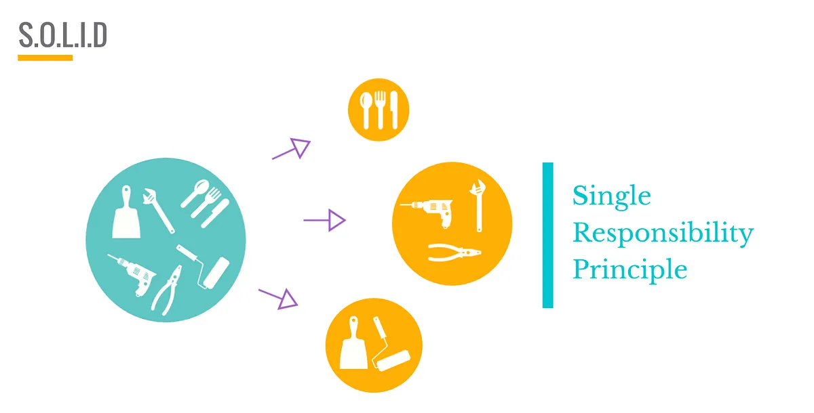

# 1 — Single Responsibility Principle (SRP)



> A class should have only one reason to change.

## 💡 The idea

"Responsibility" here means "a reason to change" — not "a single method." A class can have
several methods and still respect SRP, as long as all of them serve **one cohesive purpose**
owned by **one actor** (one type of stakeholder who could ask for a change).

## Use case

Imagine a `UserService` that creates a new user. Naively, "creating a user" seems like one
job — but it actually bundles at least three unrelated concerns:

- **Validate** the input (a business-rules concern)
- **Save** the user to a database (a persistence concern)
- **Send** a welcome email (a notification concern)

Each of those can change for a completely different reason: legal changes validation rules,
the DBA migrates to a new database, marketing changes the email provider. If all three live
in one class, *any* of those unrelated changes forces you to edit — and re-test — the same
file.

## ❌ Bad example

```java
class UserService {
    public void createUser(String email) {
        // validation
        if (!email.contains("@")) {
            throw new RuntimeException("Invalid email");
        }

        // save to DB
        System.out.println("Saving user to DB");

        // send email
        System.out.println("Sending email");
    }
}
```

👉 Problems:

- Multiple responsibilities mixed into one method
- Hard to unit test (can't test validation without triggering "DB" and "email" side effects)
- Hard to modify safely (touching email logic risks breaking validation or persistence)

## ✅ Good example

```java
class UserValidator {
    public void validate(String email) {
        if (!email.contains("@")) {
            throw new RuntimeException("Invalid email");
        }
    }
}

class UserRepository {
    public void save(String email) {
        System.out.println("Saving user to DB");
    }
}

class EmailService {
    public void sendEmail(String email) {
        System.out.println("Sending email");
    }
}

class UserService {
    private final UserValidator validator = new UserValidator();
    private final UserRepository repository = new UserRepository();
    private final EmailService emailService = new EmailService();

    public void createUser(String email) {
        validator.validate(email);
        repository.save(email);
        emailService.sendEmail(email);
    }
}
```

👉 Now each class has one job, and `UserService` simply orchestrates them.

## How to spot a violation

- The class name is vague (`Manager`, `Service`, `Helper`, `Util`) and does "everything"
- You struggle to name the class without using "and" (`ValidatorAndSaver`)
- A single method mixes different *levels* of concern (business rule + I/O + formatting)
- Two different people/teams would ask you to change the same class for unrelated reasons

## Real-world mapping

SRP is the principle behind **microservices** and clean **separation of concerns**: each
service, module, or class should be owned by one team, for one reason.

## Examples

| # | Focus |
|---|-------|
| 01 | `UserService` doing validation + persistence + email (violation) |
| 02 | Split into `UserValidator`, `UserRepository`, `EmailService`, `SMSService` (fixed) |

## Build & run

```sh
cd examples/01-bad-example
javac Main.java && java Main
```

```sh
cd examples/02-good-example
javac Main.java && java Main
```

## Next

### [2. Open/Closed Principle →](../2-OPEN-CLOSED-PRINCIPLE/)
