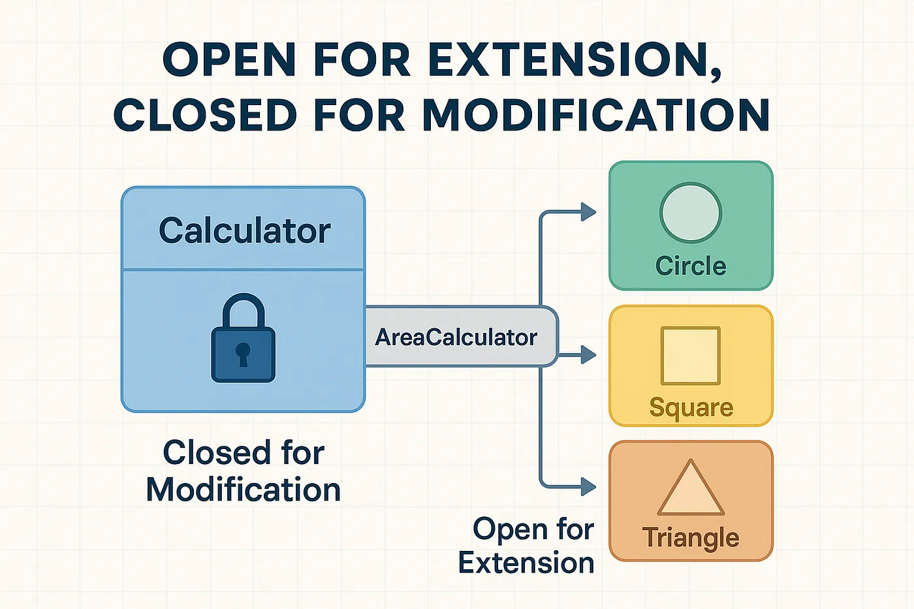

# 2 — Open/Closed Principle (OCP)



> Software entities should be **open for extension**, but **closed for modification**.

## 💡 The idea

You should be able to add new behavior to a system **without editing code that already
works**. If adding a feature always means opening an existing, tested class and adding
another `if`/`else` branch, that class is not closed for modification — it's a permanent
construction site.

The usual fix is **polymorphism**: define an abstraction (interface or abstract class), let
existing code depend on that abstraction, and add new behavior by writing a *new*
implementation instead of touching the old one.

## Use case

A payment system starts with credit card and PayPal, but the business will keep adding new
payment methods (crypto, local providers, etc.) for years to come.

## ❌ Bad example

```java
class PaymentService {
    public void pay(String type) {
        if (type.equals("card")) {
            System.out.println("Pay with card");
        } else if (type.equals("paypal")) {
            System.out.println("Pay with PayPal");
        } else if (type.equals("m10")) {
            System.out.println("Pay with M10");
        }
    }
}
```

👉 Adding a new payment method = modifying existing, already-shipped code → risk of breaking
every branch that came before it.

## ✅ Good example

```java
interface Payment {
    void pay();
}

class CardPayment implements Payment {
    public void pay() { System.out.println("Pay with card"); }
}

class PaypalPayment implements Payment {
    public void pay() { System.out.println("Pay with PayPal"); }
}

class M10Payment implements Payment {
    public void pay() { System.out.println("Pay with M10"); }
}

class PaymentService {
    public void process(Payment payment) {
        payment.pay();
    }
}

PaymentService paymentService = new PaymentService();
paymentService.process(new M10Payment());
```

👉 Adding a new payment method now just means creating a new class — `PaymentService` never
changes again.

## How to spot a violation

- A long `if`/`else` or `switch` chain that dispatches on a "type" string or enum
- Every time a new "kind of X" is added to the product, the same class gets edited
- Comments like `// TODO: add new case here` sprinkled through business logic

## Real-world mapping

OCP is the theoretical basis for the **Strategy pattern** and for **plugin architectures**:
the core system exposes an extension point (an interface), and new capabilities are added as
plugins that implement it — with zero changes to the core.

## Examples

| # | Focus |
|---|-------|
| 01 | `PaymentService` branching on a type string (violation) |
| 02 | `Payment` interface + one class per payment method (fixed) |

## Build & run

```sh
cd examples/01-bad-example
javac Main.java && java Main
```

```sh
cd examples/02-good-example
javac Main.java && java Main
```

## 🏋️ Practice exercise

Once the examples above make sense, apply OCP yourself on a fresh scenario:

### [Exercise: Customer Discount Calculator →](./exercise/)

Turn a growing `if`/`else` discount lookup into a `DiscountPolicy` abstraction that new
customer tiers can plug into, with zero changes to existing code.

## Next

### [3. Liskov Substitution Principle →](../3-LISKOV-SUBSTITUTION-PRINCIPLE/)
