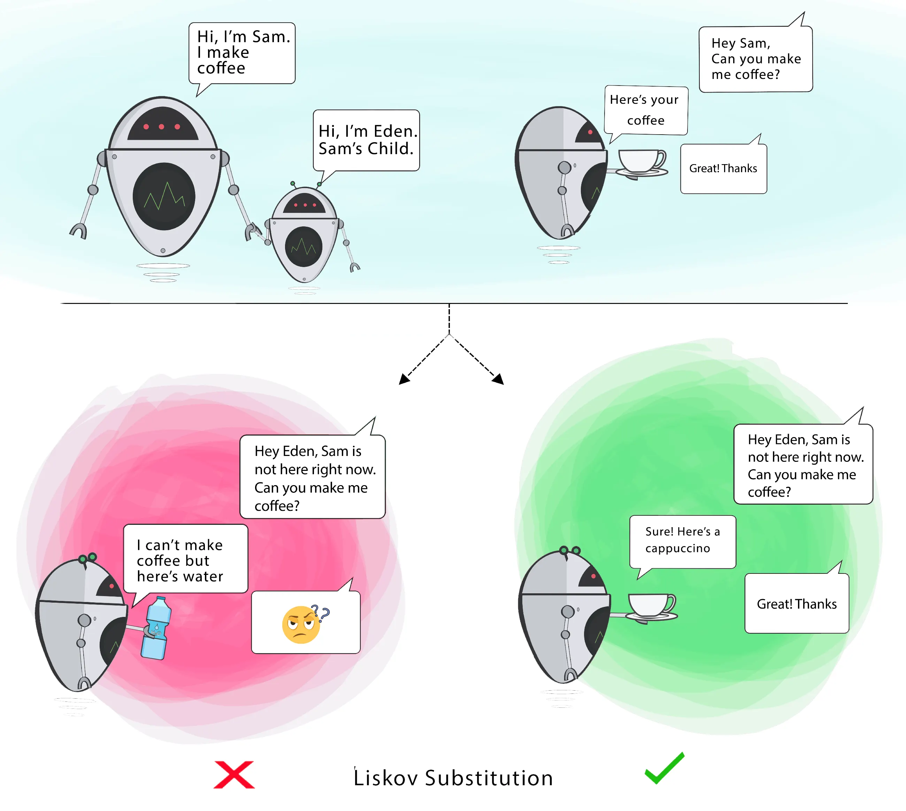

# 3 — Liskov Substitution Principle (LSP)



> Subtypes must be substitutable for their base types, without breaking the correctness of
> the program.

## 💡 The idea

If `Sparrow extends Bird`, then any code that works with a `Bird` must keep working, without
modification, when handed a `Sparrow` instead. LSP is not about the type system letting you
substitute one class for another (the compiler already guarantees that) — it's about the
**behavior** staying correct when you do.

A classic red flag: a subclass that overrides a method just to throw an exception, return a
dummy value, or do nothing. That subclass technically *is-a* base type, but it silently
breaks the base type's contract.

## Use case

The textbook example: a `Bird` class with a `fly()` method, and a `Penguin` that — being a
bird — extends it, even though penguins cannot fly.

## ❌ Bad example

```java
class Bird {
    public void fly() { System.out.println("Flying"); }
}

class Penguin extends Bird {
    public void fly() {
        throw new UnsupportedOperationException();
    }
}
```

👉 Any code written against `Bird` (e.g. `for (Bird b : birds) b.fly();`) now crashes the
moment it meets a `Penguin`. The substitution is unsafe.

## ✅ Good example

```java
class Bird {}

interface FlyingBird {
    void fly();
}

class Sparrow extends Bird implements FlyingBird {
    public void fly() { System.out.println("Flying"); }
}

class Penguin extends Bird {
    // no fly() — and no obligation to have one
}
```

👉 Flight becomes its own capability (`FlyingBird`). Code that needs to fly something asks
for a `FlyingBird`, so only birds that can actually fly are ever passed in — a `Penguin`
can't even compile its way into that code path.

## How to spot a violation

- An override that throws `UnsupportedOperationException`, returns `null`/`0`/`false` as a
  no-op, or silently does nothing where the base type promised real behavior
- A subclass that strengthens preconditions (demands more from the caller) or weakens
  postconditions (promises less back) than its base type
- Client code that checks `instanceof` to special-case one particular subtype

## Real-world mapping

LSP is what separates **correct inheritance modeling** from inheritance used purely for code
reuse. "Is a `Penguin` a `Bird`?" biologically, yes — but modeling it that way only works if
every operation you put on `Bird` is one every bird can actually perform.

## Examples

| # | Focus |
|---|-------|
| 01 | `Penguin extends Bird` and breaks `fly()` (violation) |
| 02 | Flight pulled into a `FlyingBird` interface (fixed) |

## Build & run

```sh
cd examples/01-bad-example
javac Main.java && java Main
```

```sh
cd examples/02-good-example
javac Main.java && java Main
```

## 🏋️ Practice exercise

Once the examples above make sense, apply LSP yourself on a fresh scenario:

### [Exercise: Shape Area Calculator →](./exercise/)

Fix the classic `Square extends Rectangle` violation so substituting one shape for another
can never silently produce the wrong area.

## Next

### [4. Interface Segregation Principle →](../4-INTERFACE-SEGREGATION-PRINCIPLE/)
