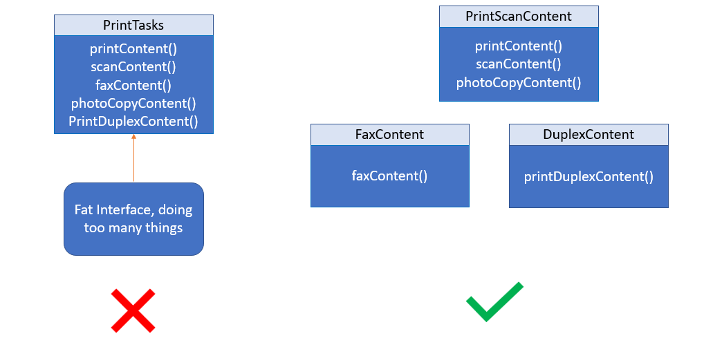

# 4 — Interface Segregation Principle (ISP)



> Clients should not be forced to depend on methods they do not use.

## 💡 The idea

A "fat" interface that bundles many unrelated methods forces every implementer to provide
*all* of them, even the ones that make no sense for that particular class. The fix is to
split large interfaces into small, focused ones, so a class only ever implements the
capabilities it genuinely has.

ISP is basically SRP applied to interfaces: one interface, one cohesive capability.

## Use case

A `Worker` interface for a factory system that must represent both humans and robots:

- Humans **work** and **eat** (need breaks, meals)
- Robots only **work** — they never eat

## ❌ Bad example

```java
interface Worker {
    void work();
    void eat();
}

class Robot implements Worker {
    public void work() {
        System.out.println("Working");
    }

    public void eat() {
        throw new UnsupportedOperationException();
    }
}
```

👉 `Robot` is forced to implement `eat()` even though it's meaningless for a robot — the only
options are to fake it or throw, and either one is a design smell.

## ✅ Good example

```java
interface Workable {
    void work();
}

interface Eatable {
    void eat();
}

class Human implements Workable, Eatable {
    public void work() { System.out.println("Working"); }
    public void eat() { System.out.println("Eating"); }
}

class Robot implements Workable {
    public void work() { System.out.println("Working"); }
}
```

👉 `Robot` implements only what it can actually do. Adding `Sleepable` later won't force a
single change onto `Robot`.

## How to spot a violation

- An implementation has a method body that's empty, throws, or returns a fake default just
  to satisfy the interface
- An interface keeps growing every time *any* implementer needs *anything* new
- Callers only ever use a handful of methods from a much larger interface

## Real-world mapping

ISP drives good **API design**: small, role-based interfaces (`Readable`, `Writable`,
`Closeable` in Java's own I/O library) compose better than one giant interface that tries to
do everything.

## Examples

| # | Focus |
|---|-------|
| 01 | One `Worker` interface forcing `Robot` to fake `eat()` (violation) |
| 02 | Split into `Workable` / `Eatable` (fixed) |

## Build & run

```sh
cd examples/01-bad-example
javac Main.java && java Main
```

```sh
cd examples/02-good-example
javac Main.java && java Main
```

## 🏋️ Practice exercise

Once the examples above make sense, apply ISP yourself on a fresh scenario:

### [Exercise: Office Printer Fleet →](./exercise/)

Split a fat `MultiFunctionDevice` interface so a print-only device is never forced to fake
scanning or faxing.

## Next

### [5. Dependency Inversion Principle →](../5-DEPENDENCY-INVERSION-PRINCIPLE/)
