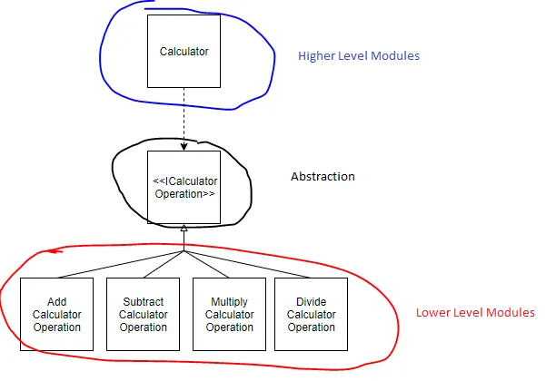

# 5 — Dependency Inversion Principle (DIP)



> Depend on abstractions, not on concrete implementations.

## 💡 The idea

DIP has two parts, and both matter:

1. High-level modules (business logic/policy) should not depend on low-level modules
   (implementation detail). Both should depend on **abstractions**.
2. Abstractions should not depend on details. Details should depend on abstractions.

In practice: instead of a class *constructing* the objects it needs (`new EmailService()`
buried inside it), it should *receive* something that satisfies an interface — usually
through its constructor. This is called **Dependency Injection**, and it's the mechanical
technique that makes DIP possible.

## Use case

A `Notification` class needs to send messages, but "how" (email, SMS, push) shouldn't be
baked into it — the business only cares that *some* channel notifies the user.

## ❌ Bad example

```java
class EmailService {
    public void send() { System.out.println("Sending email"); }
}

class SmsService {
    public void send() { System.out.println("Sending sms"); }
}

class Notification {
    private EmailService emailService = new EmailService();
    private SmsService smsService = new SmsService();

    public void notifyUser() {
        emailService.send();
    }
}
```

👉 `Notification` (high-level policy: "notify the user") is welded to `EmailService`
(low-level detail: "how an email is sent"). Swapping channels — or testing without a real
email service — means editing `Notification`'s source.

## ✅ Good example

```java
interface MessageService {
    void send();
}

class EmailService implements MessageService {
    public void send() { System.out.println("Sending email"); }
}

class SMSService implements MessageService {
    public void send() { System.out.println("Sending SMS"); }
}

class PushService implements MessageService {
    public void send() { System.out.println("Sending a notification badge to the mobile app"); }
}

class Notification {
    private final MessageService service;

    public Notification(MessageService service) {
        this.service = service;
    }

    public void notifyUser() {
        service.send();
    }
}

Notification byEmail = new Notification(new EmailService());
byEmail.notifyUser();

Notification byPush = new Notification(new PushService());
byPush.notifyUser();
```

👉 Both `Notification` (high-level) and `EmailService`/`PushService` (low-level) depend on
the same `MessageService` abstraction. You can inject anything that implements it — including
a fake one in a unit test.

## How to spot a violation

- `new SomeConcreteClass()` appears inside a class that represents business logic
- You can't unit test a class without its real dependencies (a real DB, a real HTTP client)
  spinning up
- Swapping an implementation (e.g. a different payment gateway) requires editing the class
  that *uses* it, not just adding a new class

## Real-world mapping

DIP is exactly what dependency-injection frameworks (Spring, etc.) automate: you declare
dependencies as interfaces, and the framework wires in the concrete implementation for you
at startup — production code gets the real thing, tests get a mock.

## Examples

| # | Focus |
|---|-------|
| 01 | `Notification` constructing its own `EmailService`/`SmsService` (violation) |
| 02 | `Notification` depends on `MessageService`, injected via constructor (fixed) |

## Build & run

```sh
cd examples/01-bad-example
javac Main.java && java Main
```

```sh
cd examples/02-good-example
javac Main.java && java Main
```

## 🏋️ Practice exercise

Once the examples above make sense, apply DIP yourself on a fresh scenario:

### [Exercise: Swappable Order Storage →](./exercise/)

Free an `OrderProcessor` from constructing its own database, so storage can be swapped —
including for a fast in-memory test double — without touching `OrderProcessor` at all.

## Big picture — how the five work together

- **SRP** → clean structure (one reason to change, per class)
- **OCP** → extensibility (add behavior without editing what already works)
- **LSP** → safe inheritance (subtypes never surprise their callers)
- **ISP** → clean interfaces (depend only on what you actually use)
- **DIP** → loose coupling (depend on abstractions, inject the details)

Together: scalable, testable, maintainable systems. See them applied together, end-to-end,
in the [Complete Practice Exercise →](../6-COMPLETE-PRACTICE-EXERCISE/).

## Next

### [Complete Practice Exercise: refactor an e-commerce checkout system →](../6-COMPLETE-PRACTICE-EXERCISE/)
