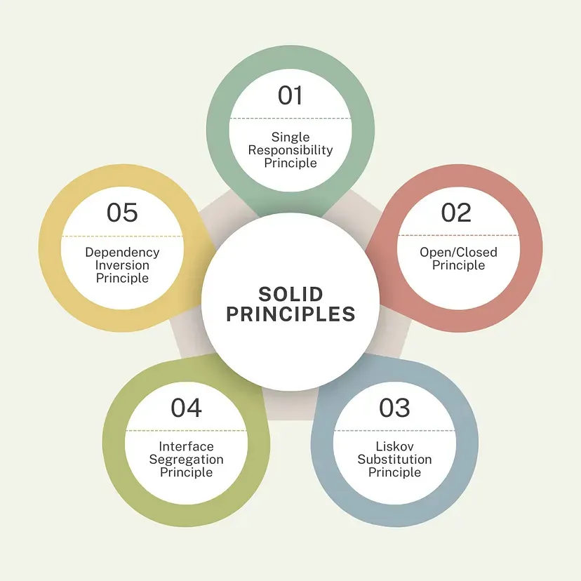

# SOLID Principles in Java — Theory, Examples & Exercises



A structured set of Java exercises on the **SOLID** principles, organized by principle. Each
numbered lesson folder contains a **theory README**, worked **examples** (a "bad" version and
a "good," refactored version you can read and run), and a hands-on **capstone exercise** at
the end that ties all five principles into one realistic system. Written for developers who
already know OOP basics (classes, interfaces, inheritance) and are ready to learn how to
*design* with them.

This repository is the SOLID chapter of a broader **Code Quality** track (Code Review, Clean
Code, SOLID, Design Patterns) — it focuses on SOLID specifically, in depth.

## Philosophy

Most resources don't give you stepwise, progressive exercises that actually build practice
with SOLID — they explain the theory and assume the rest will take care of itself once you're
working on real projects. That's often not true, or at best it takes a very long time: on a
real project you absorb SOLID indirectly, tangled up with operational concerns and tech-stack
noise, not through focused, deliberate practice. Without that structure, it's easy to stay
confused about SOLID for far longer than necessary.

This repo exists to fix that: each principle gets its own theory, a bad/good example pair you
run yourself, and a shared capstone exercise that forces you to actually *apply* all five,
deliberately, before you ever have to reach for them under deadline pressure on the job.

**SOLID is not a checklist to memorize. It's a set of answers to "why did this code become
hard to change?"**

Before jumping into Design Patterns, it's far more valuable to learn and practice **SOLID**
first — Design Patterns, Domain-Driven Design (DDD), and Clean Architecture are all built on
top of these five ideas. SOLID is harder to grasp than plain OOP, but once it actually clicks,
everything that comes after it gets dramatically easier to understand.

Every principle here exists to fix a concrete, recurring pain:

- Code that's scary to touch because one class does too much → **SRP**
- Every new feature means editing code that already worked → **OCP**
- A subclass that technically compiles but breaks its parent's promises → **LSP**
- An interface so bloated that half its methods are faked or throw → **ISP**
- Business logic welded to database/email/HTTP details, impossible to test → **DIP**

**Prerequisite: know OOP well first.** These principles assume you're already comfortable
with classes, interfaces, and polymorphism — SOLID is what comes *after* OOP, not instead of
it. If you need that foundation first, start with
[cpp-oop-examples-and-exercises](https://github.com/rusterman/cpp-oop-examples-and-exercises),
the companion OOP fundamentals repo this one follows in spirit and structure, then come back
here.

> **Don't just learn the five letters. Learn to recognize the pain each one solves — that's
> what lets you apply them without a cheat sheet.**

## Learning path

The material is organized progressively — each lesson builds toward the capstone exercise.

### [1. Single Responsibility Principle →](./1-SINGLE-RESPONSIBILITY-PRINCIPLE/)

A class should have only one reason to change. Splitting validation, persistence, and
notification out of one bloated `UserService`.

### [2. Open/Closed Principle →](./2-OPEN-CLOSED-PRINCIPLE/)

Open for extension, closed for modification. Replacing an `if`/`else` payment dispatcher with
a `Payment` interface.

### [3. Liskov Substitution Principle →](./3-LISKOV-SUBSTITUTION-PRINCIPLE/)

Subtypes must be safely substitutable for their base type. The classic `Bird`/`Penguin`
example, and why `fly()` shouldn't live on `Bird` at all.

### [4. Interface Segregation Principle →](./4-INTERFACE-SEGREGATION-PRINCIPLE/)

Don't force classes to implement methods they don't need. Splitting a fat `Worker` interface
into `Workable` and `Eatable`.

### [5. Dependency Inversion Principle →](./5-DEPENDENCY-INVERSION-PRINCIPLE/)

Depend on abstractions, not concrete classes. Injecting a `MessageService` interface into
`Notification` instead of constructing `EmailService` directly.

### [6. Capstone Exercise →](./6-CAPSTONE-EXERCISE/)

Refactor a monolithic e-commerce checkout system by applying all five principles, one stage
at a time — with reference solutions for each stage.

## Structure

```csv
images/                               overview image used by this root README
1-SINGLE-RESPONSIBILITY-PRINCIPLE/    one reason to change, per class
2-OPEN-CLOSED-PRINCIPLE/              extend behavior without editing what already works
3-LISKOV-SUBSTITUTION-PRINCIPLE/      subtypes that never break their base type's promises
4-INTERFACE-SEGREGATION-PRINCIPLE/    small, focused interfaces over one fat interface
5-DEPENDENCY-INVERSION-PRINCIPLE/     depend on abstractions, inject the concrete details
6-CAPSTONE-EXERCISE/                  all five principles applied to one system, step by step
```

Each principle folder follows the same shape, with its own `images/` folder:

```csv
N-PRINCIPLE-NAME/
├── README.md                  theory: the idea, a bad example, a good example, how to spot it
├── images/                    the diagram used by this folder's README
└── examples/
    ├── 01-bad-example/Main.java    the violation, runnable
    └── 02-good-example/Main.java   the fix, runnable
```

## Setup and requirements

### A Java Development Kit (JDK)

Any JDK 17+ works. Examples use `javac`/`java` directly — no build tool required.

**macOS**

```bash
brew install openjdk@17
```

**Windows**

Download the installer from [adoptium.net](https://adoptium.net/) and run it, accepting the
defaults.

**Ubuntu / Debian**

```bash
sudo apt update && sudo apt install -y openjdk-17-jdk
```

Verify it worked (any platform):

```bash
java -version
javac -version
```

## Getting started

New to Git/GitHub/forking? The prerequisite
[cpp-oop-examples-and-exercises](https://github.com/rusterman/cpp-oop-examples-and-exercises#setup-and-requirements)
repo walks through what each of those is. The short version, for this repo:

### 1. Fork the repository

Click **Fork** on [github.com/rusterman/solid-principles-java](https://github.com/rusterman/solid-principles-java)
to create your own copy under your GitHub account. You'll work and commit inside your fork,
not the original.

### 2. Clone your fork

Replace `<your-username>` with your GitHub username:

```bash
git clone https://github.com/<your-username>/solid-principles-java.git
cd solid-principles-java
```

Optionally, add the original repo as `upstream` so you can pull in future updates:

```bash
git remote add upstream https://github.com/rusterman/solid-principles-java.git
git remote -v   # origin = your fork, upstream = original
```

## How to work through this guide

1. **Go in lesson order** — `1-SINGLE-RESPONSIBILITY-PRINCIPLE` → ... →
   `5-DEPENDENCY-INVERSION-PRINCIPLE` → `6-CAPSTONE-EXERCISE`. Each principle is easier to see
   clearly once you've internalized the one before it.
2. **Read the lesson's `README.md` first** — the idea, the bad example, the good example, and
   how to recognize the violation in code you didn't write.
3. **Run both examples.** Don't just read the diff — compile and execute `01-bad-example` and
   `02-good-example`, then change something and re-run it.
4. **Finish with the capstone exercise.** Attempt each refactor stage yourself before opening
   the matching file under `6-CAPSTONE-EXERCISE/solutions/`.

### Build & run any example

```sh
cd 1-SINGLE-RESPONSIBILITY-PRINCIPLE/examples/02-good-example
javac Main.java && java Main
```

### Rules for learning

- **Don't just read the "good" example.** Compile and run the "bad" one first, and feel the
  problem before you see the fix.
- **Don't memorize the five names.** If you can explain *why* a piece of code is painful to
  change, you already understand the principle behind the fix.
- **Don't skip the capstone.** The individual lessons show you *one* principle in isolation;
  the exercise is where you practice recognizing *which* principle a real problem needs.

## Submitting your solutions

Use one branch per person, named after your GitHub username, so your capstone attempt is easy
to find and never collides with anyone else's fork history:

| Step | Command |
|------|---------|
| Create your solution branch | `git checkout -b solutions/<your-username>` |
| Work locally, commit per stage | `git add .`<br>`git commit -m "capstone: stage 1 - SRP refactor"` |
| Push your branch to your fork | `git push -u origin solutions/<your-username>` |

Replace `<your-username>` with your actual GitHub username. Commit each capstone stage
separately (`capstone: stage 1 - SRP`, `capstone: stage 2 - OCP`, ...) so your progress is easy
to follow, and try each stage yourself before opening the matching file in
[`6-CAPSTONE-EXERCISE/solutions/`](./6-CAPSTONE-EXERCISE/solutions/). Once pushed, you can open
a pull request from `solutions/<your-username>` into your own fork's `main` for a clean,
reviewable diff of your work.

---

The goal isn't just to name-drop "SOLID" in an interview — it's to look at a real class and
naturally ask: *what's the one reason this should change, and does the rest of this file
agree?* That's the difference between reciting principles and designing with them.

## Start learning

### [1. Single Responsibility Principle →](./1-SINGLE-RESPONSIBILITY-PRINCIPLE/)

### [2. Open/Closed Principle →](./2-OPEN-CLOSED-PRINCIPLE/)

### [3. Liskov Substitution Principle →](./3-LISKOV-SUBSTITUTION-PRINCIPLE/)

### [4. Interface Segregation Principle →](./4-INTERFACE-SEGREGATION-PRINCIPLE/)

### [5. Dependency Inversion Principle →](./5-DEPENDENCY-INVERSION-PRINCIPLE/)

### [6. Capstone Exercise →](./6-CAPSTONE-EXERCISE/)

## Author

Created and maintained by [Rustam Atakisiev](https://github.com/rusterman) — also the author
of the companion [cpp-oop-examples-and-exercises](https://github.com/rusterman/cpp-oop-examples-and-exercises)
repository.
